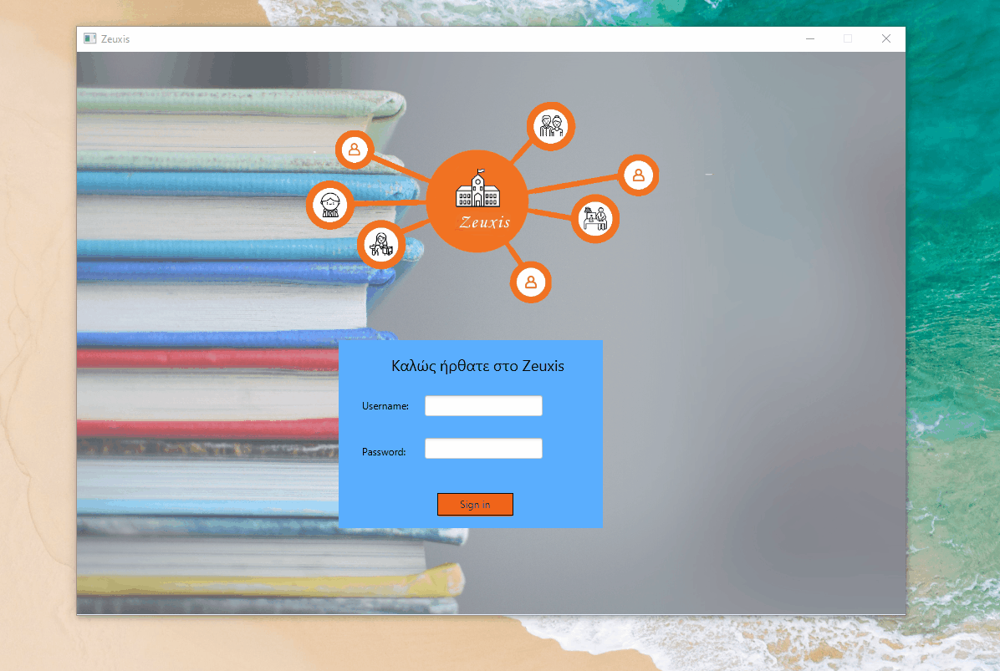
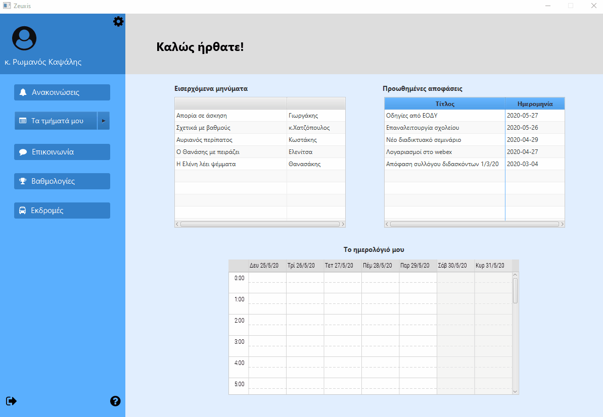
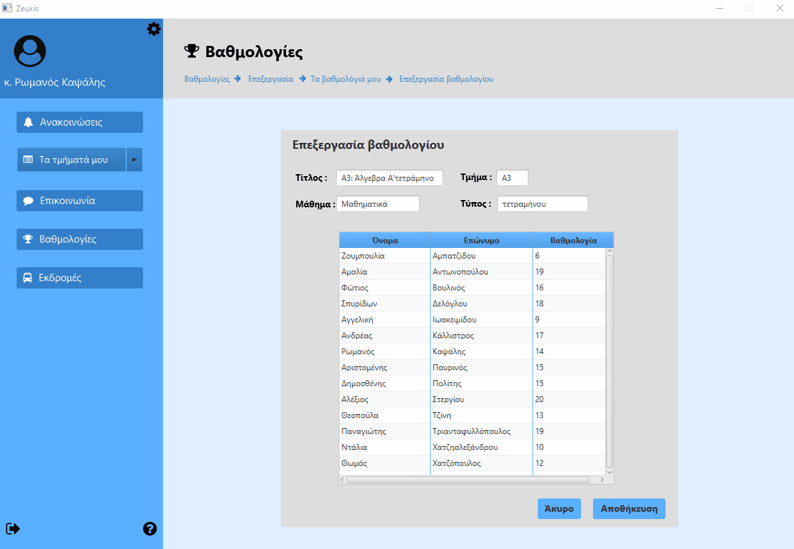
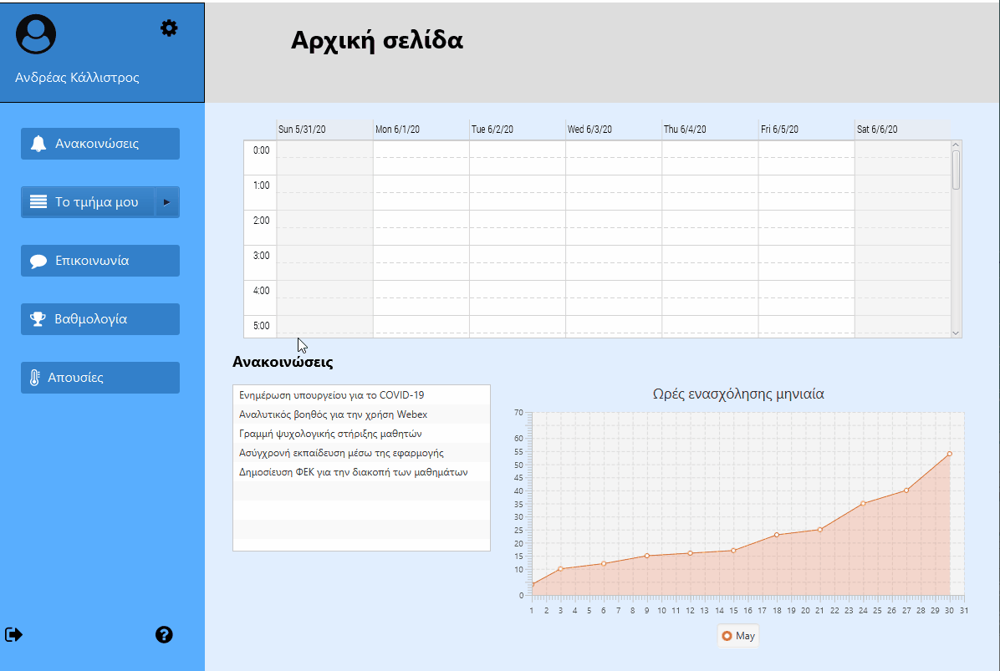
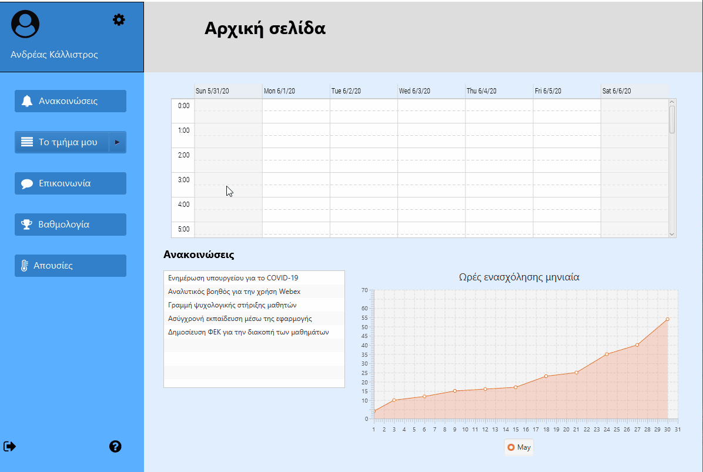
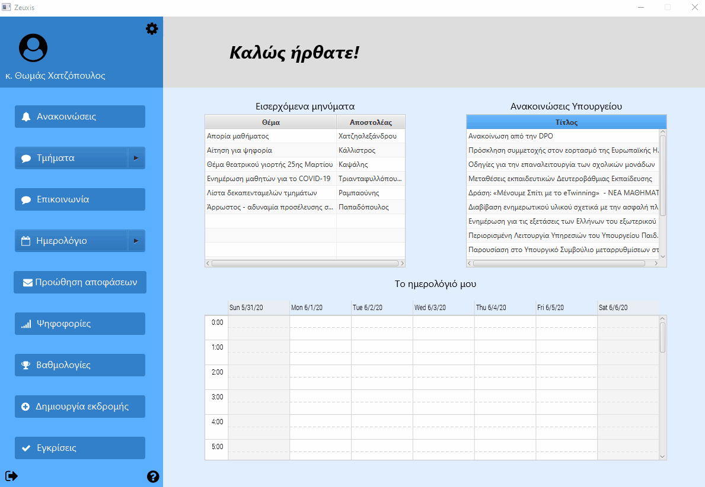
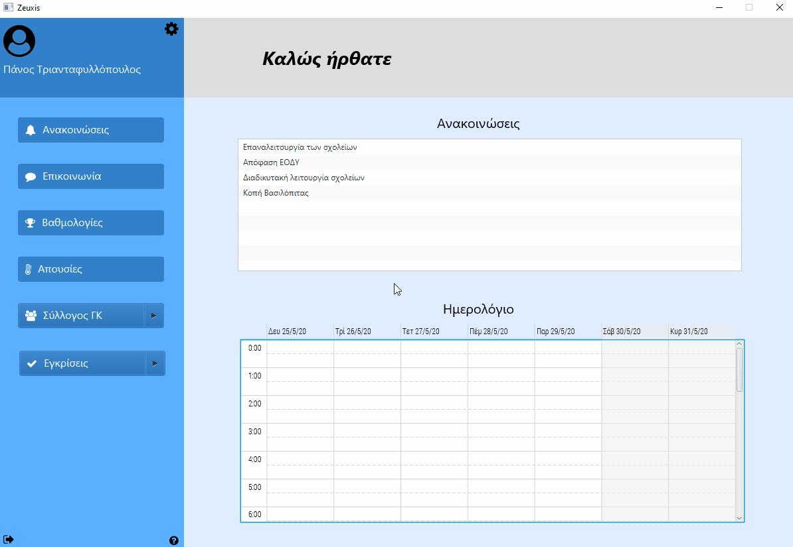
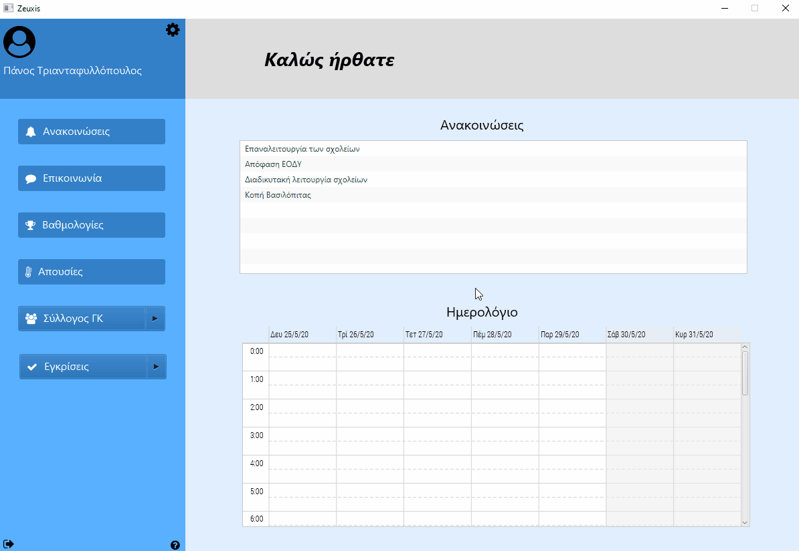

# Zeuxis
Project στα πλαίσια του μαθήματος "Τεχνολογία Λογισμικού" 
([Τμήμα Μηχανικών Η/Υ και Πληροφορικής](https://www.ceid.upatras.gr/), Πανεπιστήμιο Πατρών).
## Authors
* Κάλλιστρος Ανδρέας
* Καψάλης Ρωμανός
* Τριανταφυλλόπουλος Παναγιώτης
* Χατζόπουλος Θωμάς

## Περιγραφή και GIF λειτουργίας
Για την υλοποίηση του πρότζεκτ χρησιμοποιήσαμε Java και συγκεκριμένα την βιβλιοθήκη Java Fx 14.0.1.
Επιπλέον βιβλιοθήκες που χρησιμοποιήθηκαν μπορουν να βρεθούν (ως .jar αρχεία) στον φάκελο External Libraries.
Για περισσότερες πληροφορίες σχετικά με την εγκατάσταση των βιβλιοθηκών μπορούν να βρεθούν εδώ: https://openjfx.io/openjfx-docs/

Το πρότζεκτ μας αφορά μια εφαρμογή για την καλύτερη οργάνωση και λειτουργία μιας σχολικής μονάδας. Η εφαρμογή 
λέγεται Zeuxis και είναι για τον υπολογιστή.Στην εφαρμογή μας υπάρχουν 4 modules (Καθηγητής, Μαθητής, Γονέας, Διεύθυνση). 
Παρακάτω παρουσιάζουμε μερικές απο τις βασικές λειτουργίες του Zeuxis ανά module όπως έχουν υλοποιηθεί στην παρούσα έκδοση.

### Είσοδος στην εφαρμογή
Για τον μαθητή τα credentials είναι :
username: st12
password: 12345

Για τον καθηγητή τα credentials είναι :
username: tc12
password: 12345

Για την διεύθυνση τα credentials είναι :
username: tc13
password: 12345

Για τον μαθητή τα credentials είναι :
username: pt12
password: 12345

### Καθηγητής
* Αποστολή βαθμολογίου στην διεύθυνση (Use case 15):

* Οργάνωση εκδρομής (Use case 17):

* Επεξεργασία βαθμολογίου (Use case 18):

### Μαθητής
* Προβολή Βιβλίου Ύλης ενός μαθήματος (Use case 1):

* Προσθήκη νέας συζήτησης σε κάποιο μάθημα (Use case 3):

* Προβολή βαθμολογιών Προόδου και Τελικό Έλεγχο ενός μαθητή (Use case 4):

### Διεύθυνση
* Εξαγωγή στοιχείων μαθητών τμήματος (Use Case 7)

* Προώθηση αποφάσεων (Use Case 11)

### Γονέας
* Εμφάνιση Έργου Συλλόγου γονέων και κηδεμόνων (Use case 5)

* Έγκριση εγγράφου (Use case 6)

## License
This project is licensed under the MIT License - see the LICENSE.md file for details.
